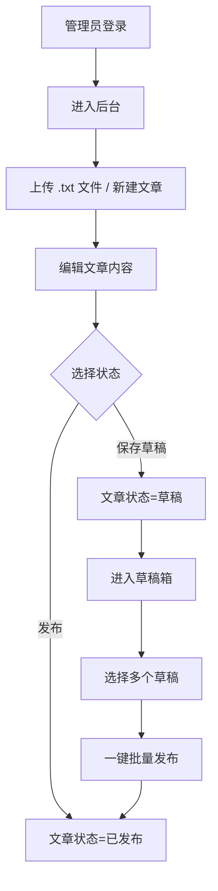
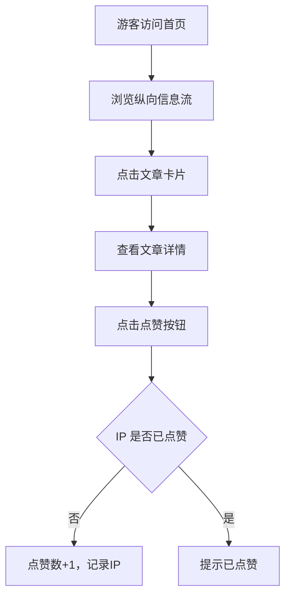

## 1. 产品概述

个人博客系统，为内容创作者提供优雅的文章发布与管理平台，为读者提供沉浸式纵向单列信息流阅读体验。

- 支持管理员通过拖拽上传 .txt 文件，后端自动解析 Markdown 格式并存入数据库
- 提供完整的文章生命周期管理（CRUD）、分类标签体系、草稿箱批量发布机制
- 游客可浏览文章并按 IP 进行点赞互动

## 2. 核心特性

### 2.1 用户角色

| 角色 | 登录方式 | 核心权限 |
|------|----------|----------|
| 管理员 | JWT 账号密码登录 | 文章上传/编辑/删除、分类标签管理、草稿箱操作、批量发布 |
| 游客 | 无需登录 | 浏览文章列表、查看文章详情、按 IP 点赞文章 |

### 2.2 功能模块

1. **动态信息流页**：纵向单列文章列表、文章预览、点赞互动
2. **文章详情页**：完整 Markdown 渲染、点赞按钮、分类标签展示
3. **管理员登录页**：JWT 认证登录
4. **管理员后台 - 文章管理**：文章列表、拖拽上传、编辑、删除、状态管理
5. **管理员后台 - 分类标签管理**：分类和标签的增删改查
6. **管理员后台 - 草稿箱**：草稿筛选、批量发布、批量删除

### 2.3 页面详情

| 页面名称 | 模块名称 | 功能描述 |
|----------|----------|----------|
| 动态信息流页 | 文章列表 | 纵向单列布局，按时间倒序展示文章卡片，支持无限滚动 |
| 动态信息流页 | 文章卡片 | 展示标题、摘要、发布时间、分类标签、点赞数 |
| 动态信息流页 | 点赞按钮 | 游客按 IP 点赞，防重复点赞 |
| 文章详情页 | Markdown 渲染 | 优雅的 Markdown 内容渲染，支持代码高亮 |
| 文章详情页 | 元信息展示 | 分类、标签、发布时间、阅读时长、点赞数 |
| 管理员登录页 | 登录表单 | 账号密码输入、错误提示、登录状态持久化 |
| 文章管理页 | 拖拽上传区 | 支持拖拽 .txt 文件上传，实时上传进度 |
| 文章管理页 | 文章列表 | 表格展示所有文章，支持搜索、筛选、分页 |
| 文章管理页 | 文章编辑器 | Markdown 编辑器，支持实时预览 |
| 分类标签管理页 | 分类管理 | 分类的增删改，颜色标记 |
| 分类标签管理页 | 标签管理 | 标签的增删改查 |
| 草稿箱页 | 草稿列表 | 筛选所有草稿状态文章 |
| 草稿箱页 | 批量操作 | 全选/取消全选、一键发布、批量删除 |

## 3. 核心流程

### 3.1 管理员发布文章流程

### 3.2 游客浏览与点赞流程

## 4. 用户界面设计

### 4.1 设计风格

**设计理念：极简编辑风，以内容为核心**

- **主色调**：墨黑色 `#1a1a1a` 作为背景，营造沉浸式阅读氛围
- **强调色**：暖橙色 `#ff6b35` 用于交互元素（按钮、链接、点赞）
- **文字色**：米白色 `#f5f0e6` 正文，浅灰色 `#999` 辅助文字
- **按钮风格**：极简圆角按钮，hover 时有微妙的缩放和发光效果
- **字体**：标题使用 "Playfair Display" 优雅衬线字体，正文使用 "Inter" 无衬线字体
- **布局风格**：纵向单列信息流，居中窄幅布局（最大宽度 720px），大量留白
- **图标风格**：线性细描边图标，统一 24px 尺寸

### 4.2 页面设计概览

| 页面名称 | 模块名称 | UI 元素 |
|----------|----------|----------|
| 动态信息流页 | 顶部导航 | 极简透明导航，博客标题 + 管理员入口 |
| 动态信息流页 | 文章卡片 | 大标题 + 摘要 + 元信息，卡片间有优雅分隔线 |
| 动态信息流页 | 点赞交互 | 心形图标，点击时有填充动画和数字跳动 |
| 文章详情页 | 文章标题 | 大号衬线字体，居中展示 |
| 文章详情页 | 正文内容 | 优雅的排版层次，代码块有深色背景和圆角 |
| 管理员后台 | 侧边栏 | 深色侧边栏，图标 + 文字导航 |
| 管理员后台 | 拖拽上传区 | 虚线边框区域，拖拽时有高亮动画 |
| 草稿箱页 | 批量操作栏 | 固定在顶部的操作栏，选中时出现 |

### 4.3 响应式设计

- **桌面优先**：主要针对桌面端优化阅读体验
- **移动端适配**：在 768px 以下自动调整布局，侧边栏转为底部导航
- **触摸优化**：按钮最小尺寸 44x44px，确保移动端点击区域充足

### 4.4 动效设计

- **页面加载**：文章卡片按顺序渐入，stagger 延迟 100ms
- **点赞动画**：心形图标从空心变实心，有轻微弹跳效果
- **拖拽上传**：文件进入上传区域时边框高亮，背景轻微变色
- **滚动效果**：导航栏随滚动渐变为不透明背景
- **悬停效果**：文章卡片悬停时标题轻微上浮，强调色下划线浮现
