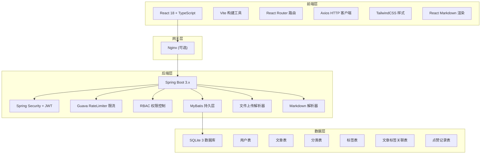
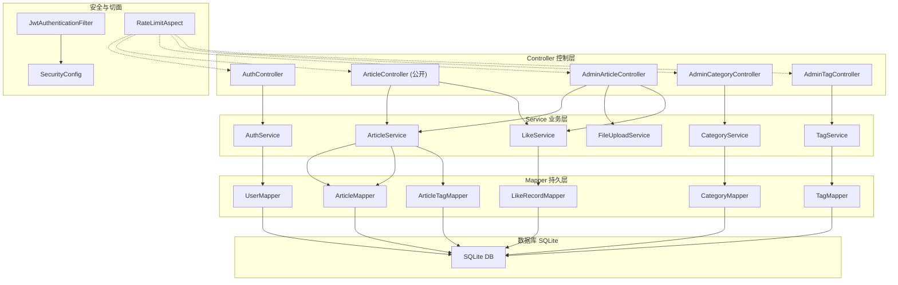

## 1. 架构设计



## 2. 技术选型说明

### 2.1 前端技术栈
- **框架**: React 18 + TypeScript
- **构建工具**: Vite 5.x
- **路由管理**: React Router v6
- **HTTP 客户端**: Axios
- **UI 样式**: TailwindCSS 3.x
- **Markdown 渲染**: react-markdown + remark-gfm
- **代码高亮**: react-syntax-highlighter
- **图标**: lucide-react
- **状态管理**: React Context + useReducer

### 2.2 后端技术栈
- **框架**: Spring Boot 3.2.x
- **安全框架**: Spring Security 6.x + JWT
- **ORM 框架**: MyBatis 3.5.x + MyBatis Spring Boot Starter
- **数据库**: SQLite 3.x (通过 sqlite-jdbc 驱动)
- **限流组件**: Google Guava RateLimiter
- **密码加密**: BCrypt
- **文件上传**: Spring Servlet MultipartFile
- **JSON 处理**: Jackson

### 2.3 项目结构

```
blog/
├── frontend/                 # 前端项目
│   ├── src/
│   │   ├── components/       # 公共组件
│   │   ├── pages/            # 页面组件
│   │   ├── context/          # 状态管理
│   │   ├── api/              # API 接口
│   │   ├── types/            # TypeScript 类型定义
│   │   ├── utils/            # 工具函数
│   │   └── App.tsx
│   ├── package.json
│   └── vite.config.ts
└── backend/                  # 后端项目
    ├── src/
    │   └── main/
    │       ├── java/com/blog/
    │       │   ├── config/       # 配置类
    │       │   ├── controller/   # 控制器
    │       │   ├── service/      # 业务逻辑
    │       │   ├── mapper/       # MyBatis Mapper
    │       │   ├── entity/       # 实体类
    │       │   ├── dto/          # 数据传输对象
    │       │   ├── security/     # 安全相关
    │       │   ├── aspect/       # 切面（限流等）
    │       │   └── BlogApplication.java
    │       └── resources/
    │           ├── mapper/       # MyBatis XML
    │           ├── application.yml
    │           └── schema.sql    # 数据库初始化
    └── pom.xml
```

## 3. 路由定义

### 3.1 前端路由

| 路由 | 页面 | 权限 | 说明 |
|------|------|------|------|
| `/` | 动态信息流页 | 公开 | 纵向单列文章列表 |
| `/article/:id` | 文章详情页 | 公开 | Markdown 文章展示 |
| `/login` | 管理员登录页 | 公开 | JWT 登录 |
| `/admin` | 后台首页 | ADMIN | 数据概览 |
| `/admin/articles` | 文章管理 | ADMIN | 文章列表、上传、编辑 |
| `/admin/articles/new` | 新建文章 | ADMIN | Markdown 编辑器 |
| `/admin/articles/edit/:id` | 编辑文章 | ADMIN | 编辑已有文章 |
| `/admin/categories` | 分类标签管理 | ADMIN | 分类和标签 CRUD |
| `/admin/drafts` | 草稿箱 | ADMIN | 草稿列表、批量发布 |

### 3.2 后端 API 路由

| 方法 | 路径 | 权限 | 说明 |
|------|------|------|------|
| POST | `/api/auth/login` | 公开 | JWT 登录获取 token |
| GET | `/api/articles` | 公开 | 获取已发布文章列表（分页） |
| GET | `/api/articles/:id` | 公开 | 获取文章详情 |
| POST | `/api/articles/:id/like` | 公开 | 按 IP 点赞文章 |
| GET | `/api/articles/:id/like/status` | 公开 | 检查当前 IP 是否已点赞 |
| POST | `/api/admin/articles/upload` | ADMIN | 拖拽上传 .txt 文件 |
| POST | `/api/admin/articles` | ADMIN | 新建文章 |
| PUT | `/api/admin/articles/:id` | ADMIN | 更新文章 |
| DELETE | `/api/admin/articles/:id` | ADMIN | 删除文章 |
| GET | `/api/admin/articles/drafts` | ADMIN | 获取草稿列表 |
| POST | `/api/admin/articles/publish/batch` | ADMIN | 批量发布草稿 |
| DELETE | `/api/admin/articles/batch` | ADMIN | 批量删除文章 |
| GET | `/api/admin/categories` | ADMIN | 获取分类列表 |
| POST | `/api/admin/categories` | ADMIN | 新增分类 |
| PUT | `/api/admin/categories/:id` | ADMIN | 更新分类 |
| DELETE | `/api/admin/categories/:id` | ADMIN | 删除分类 |
| GET | `/api/admin/tags` | ADMIN | 获取标签列表 |
| POST | `/api/admin/tags` | ADMIN | 新增标签 |
| PUT | `/api/admin/tags/:id` | ADMIN | 更新标签 |
| DELETE | `/api/admin/tags/:id` | ADMIN | 删除标签 |

## 4. API 数据结构定义

### 4.1 TypeScript 类型定义

```typescript
// 用户相关
interface User {
  id: number;
  username: string;
  role: 'ADMIN';
}

interface LoginRequest {
  username: string;
  password: string;
}

interface LoginResponse {
  token: string;
  user: User;
}

// 文章相关
interface Article {
  id: number;
  title: string;
  content: string;
  summary: string;
  status: 'DRAFT' | 'PUBLISHED';
  categoryId: number;
  category?: Category;
  tags: Tag[];
  likeCount: number;
  createdAt: string;
  updatedAt: string;
  publishedAt?: string;
}

interface ArticleCreateRequest {
  title: string;
  content: string;
  summary?: string;
  categoryId: number;
  tagIds: number[];
  status: 'DRAFT' | 'PUBLISHED';
}

interface ArticleUpdateRequest {
  title?: string;
  content?: string;
  summary?: string;
  categoryId?: number;
  tagIds?: number[];
  status?: 'DRAFT' | 'PUBLISHED';
}

// 分类
interface Category {
  id: number;
  name: string;
  color: string;
  articleCount: number;
}

// 标签
interface Tag {
  id: number;
  name: string;
  articleCount: number;
}

// 点赞
interface LikeResponse {
  liked: boolean;
  likeCount: number;
}

// 分页
interface PageResult<T> {
  list: T[];
  total: number;
  page: number;
  size: number;
}
```

### 4.2 Java DTO 定义

```java
// 统一响应
@Data
public class ApiResponse<T> {
    private int code;
    private String message;
    private T data;
}

// 登录
@Data
public class LoginRequest {
    private String username;
    private String password;
}

@Data
public class LoginResponse {
    private String token;
    private UserVO user;
}

// 文章
@Data
public class ArticleVO {
    private Long id;
    private String title;
    private String content;
    private String summary;
    private String status;
    private Long categoryId;
    private CategoryVO category;
    private List<TagVO> tags;
    private Integer likeCount;
    private LocalDateTime createdAt;
    private LocalDateTime updatedAt;
    private LocalDateTime publishedAt;
}

// 批量操作
@Data
public class BatchPublishRequest {
    private List<Long> articleIds;
}

@Data
public class BatchDeleteRequest {
    private List<Long> articleIds;
}
```

## 5. 后端服务架构



## 6. 数据模型

### 6.1 ER 图

```mermaid
erDiagram
    USER ||--o{ ARTICLE : "创建"
    CATEGORY ||--o{ ARTICLE : "包含"
    ARTICLE }o--o{ TAG : "关联"
    ARTICLE ||--o{ LIKE_RECORD : "被点赞"

    USER {
        INTEGER id PK
        TEXT username UK
        TEXT password_hash
        TEXT role
        DATETIME created_at
    }

    ARTICLE {
        INTEGER id PK
        TEXT title
        TEXT content
        TEXT summary
        TEXT status
        INTEGER category_id FK
        INTEGER like_count
        DATETIME created_at
        DATETIME updated_at
        DATETIME published_at
    }

    CATEGORY {
        INTEGER id PK
        TEXT name UK
        TEXT color
        DATETIME created_at
    }

    TAG {
        INTEGER id PK
        TEXT name UK
        DATETIME created_at
    }

    ARTICLE_TAG {
        INTEGER article_id FK
        INTEGER tag_id FK
    }

    LIKE_RECORD {
        INTEGER id PK
        INTEGER article_id FK
        TEXT ip_address
        DATETIME created_at
    }
```



### 6.2 DDL 语句

```sql
-- 用户表
CREATE TABLE IF NOT EXISTS user (
    id INTEGER PRIMARY KEY AUTOINCREMENT,
    username TEXT NOT NULL UNIQUE,
    password_hash TEXT NOT NULL,
    role TEXT NOT NULL DEFAULT 'ADMIN',
    created_at DATETIME DEFAULT CURRENT_TIMESTAMP
);

-- 文章表
CREATE TABLE IF NOT EXISTS article (
    id INTEGER PRIMARY KEY AUTOINCREMENT,
    title TEXT NOT NULL,
    content TEXT NOT NULL,
    summary TEXT,
    status TEXT NOT NULL DEFAULT 'DRAFT',
    category_id INTEGER,
    like_count INTEGER NOT NULL DEFAULT 0,
    created_at DATETIME DEFAULT CURRENT_TIMESTAMP,
    updated_at DATETIME DEFAULT CURRENT_TIMESTAMP,
    published_at DATETIME,
    FOREIGN KEY (category_id) REFERENCES category(id)
);

-- 分类表
CREATE TABLE IF NOT EXISTS category (
    id INTEGER PRIMARY KEY AUTOINCREMENT,
    name TEXT NOT NULL UNIQUE,
    color TEXT DEFAULT '#ff6b35',
    created_at DATETIME DEFAULT CURRENT_TIMESTAMP
);

-- 标签表
CREATE TABLE IF NOT EXISTS tag (
    id INTEGER PRIMARY KEY AUTOINCREMENT,
    name TEXT NOT NULL UNIQUE,
    created_at DATETIME DEFAULT CURRENT_TIMESTAMP
);

-- 文章标签关联表
CREATE TABLE IF NOT EXISTS article_tag (
    article_id INTEGER NOT NULL,
    tag_id INTEGER NOT NULL,
    PRIMARY KEY (article_id, tag_id),
    FOREIGN KEY (article_id) REFERENCES article(id) ON DELETE CASCADE,
    FOREIGN KEY (tag_id) REFERENCES tag(id) ON DELETE CASCADE
);

-- 点赞记录表
CREATE TABLE IF NOT EXISTS like_record (
    id INTEGER PRIMARY KEY AUTOINCREMENT,
    article_id INTEGER NOT NULL,
    ip_address TEXT NOT NULL,
    created_at DATETIME DEFAULT CURRENT_TIMESTAMP,
    FOREIGN KEY (article_id) REFERENCES article(id) ON DELETE CASCADE,
    UNIQUE (article_id, ip_address)
);

-- 索引
CREATE INDEX IF NOT EXISTS idx_article_status ON article(status);
CREATE INDEX IF NOT EXISTS idx_article_category ON article(category_id);
CREATE INDEX IF NOT EXISTS idx_article_created_at ON article(created_at DESC);
CREATE INDEX IF NOT EXISTS idx_like_record_ip ON like_record(ip_address);

-- 初始化管理员账号 (密码: admin123)
INSERT OR IGNORE INTO user (username, password_hash, role) 
VALUES ('admin', '$2a$10$N.zmdr9k7uOCQb376NoUnuTJ8iAt6Z5EHsM8lE9lBOsl7iAt6Z5EH', 'ADMIN');

-- 初始化默认分类
INSERT OR IGNORE INTO category (name, color) VALUES ('技术', '#ff6b35');
INSERT OR IGNORE INTO category (name, color) VALUES ('生活', '#4ecdc4');
INSERT OR IGNORE INTO category (name, color) VALUES ('随笔', '#a855f7');
```

### 6.3 安全设计

1. **JWT 认证**:
   - 登录成功后返回 JWT Token
   - Token 有效期: 24 小时
   - 后端通过拦截器验证 Token 有效性

2. **RBAC 权限控制**:
   - 基于角色的访问控制
   - `/api/admin/**` 路径需要 ADMIN 角色
   - Spring Security 配置路径权限

3. **密码安全**:
   - 使用 BCrypt 加密存储密码
   - 强度因子: 10

4. **限流策略 (Guava RateLimiter)**:
   - 登录接口: 10次/分钟/IP
   - 点赞接口: 60次/分钟/IP
   - 公开查询接口: 100次/分钟/IP
   - 管理员接口: 无严格限制，但有基础防护

5. **CSRF 防护**:
   - 纯 API 场景禁用 CSRF
   - 依赖 JWT Token 防护

6. **CORS 配置**:
   - 配置允许的前端域名
   - 允许携带认证信息
